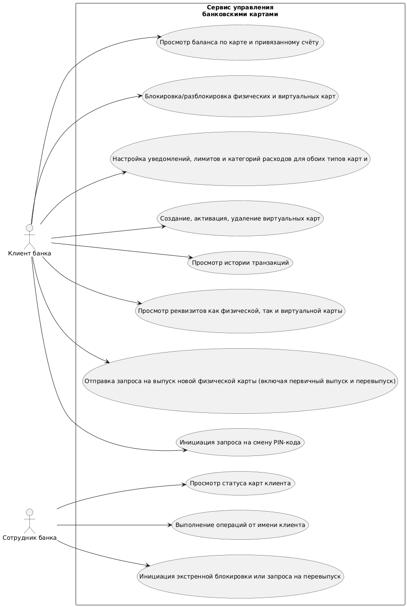

# SRS Сервис управления банковскими картами 

## Содержание

- [1. Введение](#1-введение)
- [1.1 Цель](#11-цель)
- [1.2 Область применения](#12-область-применения)
- [1.3 Определения, акронимы и сокращения](#13-определения-акронимы-и-сокращения)
- [1.4 Ссылки](#14-ссылки)
- [2. Общее описание](#2-общее-описание)
- [2.1 Взаимодействие с другими системами](#21-взаимодействие-с-другими-системами)
- [2.2 Функции продукта](#22-функции-продукта)
- [2.3 Характеристики пользователей](#23-характеристики-пользователей)
- [2.4 Ограничения](#24-ограничения)
- [2.5 Допущения и зависимости](#25-допущения-и-зависимости)
- [3. Требования](#3-требования)
- [3.1 Функциональные требования](#31-функциональные-требования)
- [3.2 Внешние интерфейсы](#32-внешние-интерфейсы)
- [3.3 Нефункциональные требования](#33-нефункциональные-требования)
- [3.4 Бизнес-правила](#34-бизнес-правила)

## 1. Введение

### 1.1 Цель
Цель данного документа — формализовать функциональные и нефункциональные требования к веб- и мобильному сервису управления банковскими картами, предназначенному для клиентов банка и сотрудников поддержки. 

Сервис предоставляет пользователям возможность безопасно управлять своими банковскими картами: просматривать баланс, блокировать/разблокировать карты, настраивать уведомления, заказывать перевыпуск, управлять виртуальными и физическими картами и совершать связанные операции. 

Документ служит основой для согласования ожиданий заказчика и исполнителя на всех этапах разработки.

### 1.2 Область применения
Сервис интегрируется с цифровой платформой банка и предоставляет следующие возможности:

**Для клиентов банка:**
- Просмотр баланса по карте и привязанному счёту 
- Блокировка/разблокировка физических и виртуальных карт 
- Настройка уведомлений, лимитов и категорий расходов для обоих типов карт 
- Создание, активация, удаление виртуальных карт 
- Просмотр истории транзакций 
- Просмотр реквизитов как физической, так и виртуальной карты 
- Отправка запроса на выпуск новой физической карты (включая первичный выпуск и перевыпуск) 
- Инициация запроса на смену PIN-кода 

**Для сотрудников службы поддержки (через внутренний интерфейс):**
- Просмотр статуса карт клиента 
- Выполнение операций от имени клиента 
- Инициация экстренной блокировки или запроса на перевыпуск 

**Сервис не включает:**
- Переводы между счетами 
- Оплату услуг или товаров 
- Открытие новых счетов 

*Рисунок 1 — Use Case диаграмма сервиса управления банковскими картами*

### 1.3 Определения и сокращения

| Термин | Описание |
|-----------------------|--------------------------------------------------------------------------|
| **2FA** | Двухфакторная аутентификация |
| **ВК** | Виртуальная карта |
| **ФК** | Физическая карта |
| **Внутренний интерфейс** | Программный интерфейс, предназначенный исключительно для сотрудников банка; доступен только из корпоративной сети или через защищённый удалённый доступ с MFA |

### 1.4 Ссылки
1. ISO/IEC/IEEE 29148:2018 — Спецификация требований к программному обеспечению 
2. PCI DSS v4.0 — Стандарт безопасности данных платёжных карт 
3. Федеральный закон № 152-ФЗ от 27.07.2006 — О персональных данных 
4. WCAG, Web Content Accessibility Guidelines — Руководство по обеспечению доступности веб-контента 

## 2. Общее описание

### 2.1 Взаимодействие с другими системами
Сервис управления банковскими картами является частью цифровой платформы банка и взаимодействует со следующими специализированными сервисами:
- Retail Banking
- Сервис бухгалтерского учёта
- Сервис управления виртуальными картами
- Сервис выдачи продуктов
- Сервис уведомлений
- Сервис аутентификации и управления правами

### 2.2 Функции продукта
- Аутентификация и управление сессиями 
- Отображение баланса и списка карт (ФК и ВК) 
- Блокировка/разблокировка 
- Управление виртуальными и физическими картами (лимиты) 
- Инициация запроса на смену PIN-кода 
- Настройка уведомлений и лимитов 
- Просмотр истории транзакций 
- Запрос на выпуск новой физической карты 
- Поддержка операций от имени клиента 

### 2.3 Характеристики пользователей
- **Клиенты**: физические лица, имеющие активные банковские карты 
- **Сотрудники банка**: операторы колл-центра и поддержки, имеющие доступ к данным клиентов через внутренний интерфейс 

### 2.4 Ограничения
- Выпуск физической карты — это запрос, а не мгновенная операция 
- Первичный выпуск ФК может требовать открытия счёта через Retail Banking 
- Сервис использует современное шифрование соединения (HTTPS на основе TLS 1.3 или новее) 

### 2.5 Допущения и зависимости
- Клиенты имеют подтверждённый email и телефон 
- Система выдачи продуктов обрабатывает заявки в течение 1 рабочего дня 

## 3. Требования

### 3.1 Функциональные требования

#### 3.1.1 Аутентификация
- **FR-01**: Вход через интернет-банк/мобильное приложение с 2FA 
- **FR-02**: Сессия завершается через 5 мин бездействия 

#### 3.1.2 Просмотр карт и баланса
- **FR-10**: Отображение всех карт (ФК и ВК) с типом, статусом, балансом 
- **FR-11**: Баланс обновляется с задержкой не более 30 секунд 

#### 3.1.3 Блокировка/разблокировка
- **FR-20**: Клиент может заблокировать любую свою карту (подтверждение — 2FA) 
- **FR-21**: Разблокировка возможна, если блокировка инициирована клиентом 
- **FR-22**: Сотрудник поддержки может блокировать карту после верификации клиента 

#### 3.1.4 Управление картами
- **FR-30**: Создание ВК с лимитом 
- **FR-31**: Активация/деактивация/удаление ВК 
- **FR-32**: Просмотр реквизитов (для ВК и ФК) 
- **FR-33**: Настройка суточных/месячных лимитов 

#### 3.1.5 Смена PIN-кода
- **FR-35**: Клиент может запросить смену PIN-кода. 
После подтверждения (2FA) запрос отправляется в систему банка. 
Новый PIN устанавливается банком через защищённые каналы. 
Клиент получает уведомление об успешной смене.

#### 3.1.6 Уведомления и лимиты
- **FR-40**: Настройка уведомлений по каналам (push/SMS/email) 

#### 3.1.7 История транзакций
- **FR-50**: Просмотр операций с фильтрацией 

#### 3.1.8 Запрос на выпуск физической карты
- **FR-60**: Клиент может инициировать запрос на выпуск новой физической карты (первичный или повторный) 
- **FR-61**: При первичном выпуске система проверяет наличие подходящего счёта; при отсутствии — предлагает открыть счёт 
- **FR-62**: При перевыпуске клиент указывает причину (утеря, окончание срока и др.) и адрес доставки 
- **FR-63**: Запрос требует подтверждения через 2FA 
- **FR-64**: После отправки заявка передаётся в Систему выдачи продуктов 
- **FR-65**: Клиент получает уведомления о статусе: «принята», «в производстве», «отправлена», «получена» 
- **FR-66**: Сотрудник поддержки может инициировать запрос на перевыпуск по звонку (с верификацией личности) 

### 3.2 Внешние интерфейсы

#### 3.2.1 Пользовательские интерфейсы
- **Веб-версия**: поддерживается в браузерах Chrome, Safari и Firefox 
- **Мобильные приложения**: для устройств на iOS (начиная с версии 14) и Android (начиная с версии 10) 
- **Внутренний интерфейс для сотрудников**: доступен только из защищённой корпоративной сети с обязательной многофакторной аутентификацией (MFA) 

#### 3.2.2 Системные интерфейсы
- Retail Banking — для получения данных о картах, счетах и выполнения операций 
- Сервис бухгалтерского учёта — формирование бухгалтерских проводок 
- Сервис управления виртуальными картами** — для выпуска и управления ВК 
- Сервис выдачи продуктов — для отправки заявок на выпуск физических карт 
- Сервис уведомлений — для отправки push/SMS/email 
- Сервис аутентификации и управления правами — для аутентификации и проверки прав доступа 

### 3.3 Нефункциональные требования
Сервис должен соответствовать следующим нефункциональным требованиям:

- **Безопасность**: соответствие стандарту PCI DSS, обязательная двухфакторная аутентификация (2FA) для клиентов, многофакторная аутентификация (MFA) для сотрудников, ведётся неизменяемый журнал всех операций для обеспечения безопасности и прозрачности 
- **Надёжность**: доступность не менее 99,95% в течение месяца 
- **Производительность**: время отклика не более 1,5 секунд для 95% запросов; время загрузки списка карт ≤ 1 секунды 
- **Масштабируемость**: поддержка до 10 000 одновременных пользователей 
- **Юзабилити**: интерфейс разрабатывается в соответствии с внутренними требованиями банка к цифровой доступности, основанными на рекомендациях WCAG AA 
- **Конфиденциальность**: соблюдение требований ФЗ-152 
- **Защита данных**: PAN хранится в зашифрованном виде (AES-256) 
- **Защита от угроз**: ограничено количество попыток входа и SMS-запросов, все запросы проверяются на наличие хакерских команд 

### 3.4 Бизнес-правила
- Максимум 5 активных ВК на клиента 
- Лимит онлайн-платежей: ≤ 500 000 RUB/сутки 
- Первичный выпуск ФК возможен только при наличии подтверждённого адреса доставки 
- Сотрудник поддержки должен верифицировать клиента по 3 параметрам перед выполнением операций 

